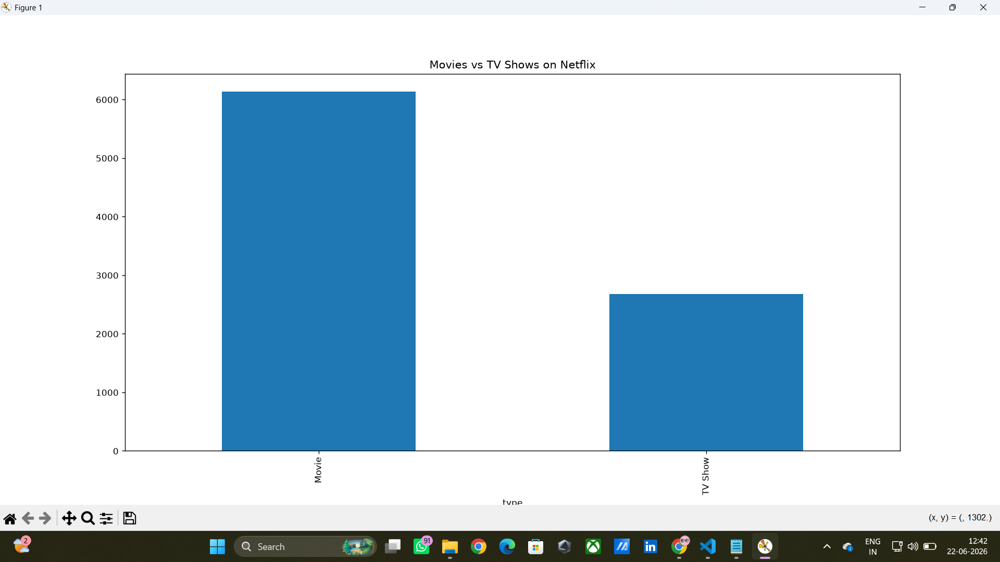
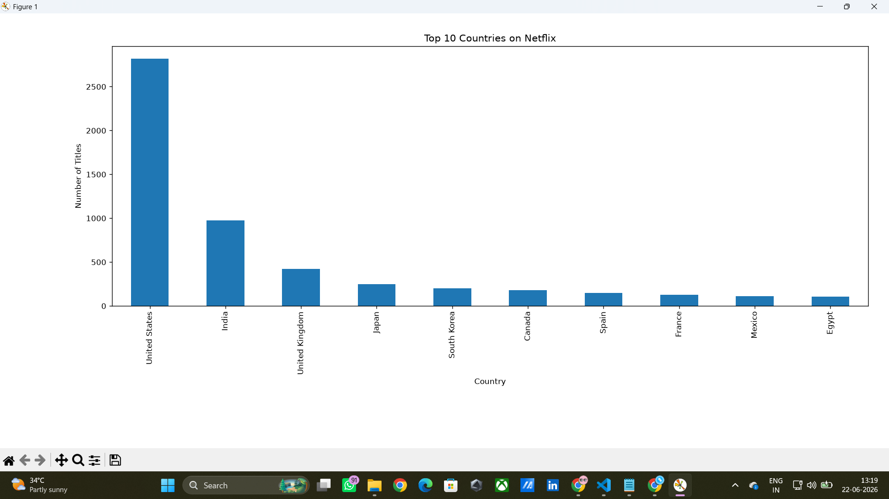
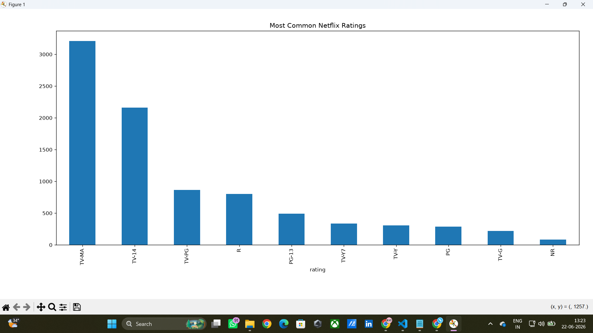
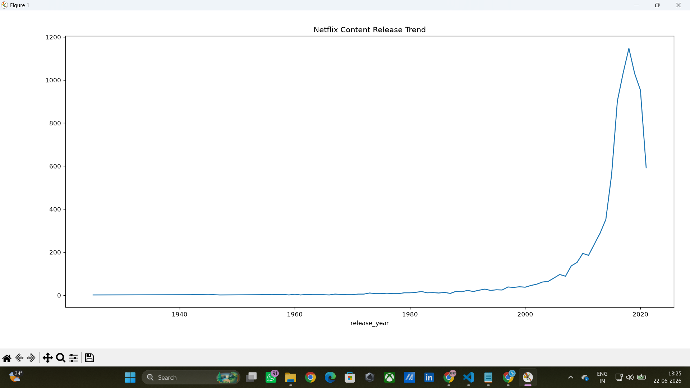

# 🎬 Netflix Data Analysis

## 📌 Project Overview

This project analyzes Netflix's content dataset using Python, Pandas, and Matplotlib to discover trends, patterns, and insights about movies and TV shows available on the platform.

The analysis focuses on content distribution, ratings, countries, and release year trends to better understand Netflix's content library.

---

## 🎯 Objectives

- Analyze the distribution of Movies and TV Shows.
- Identify the top countries producing Netflix content.
- Explore content ratings and classifications.
- Analyze release year trends.
- Perform data cleaning and exploratory data analysis (EDA).
- Generate meaningful business insights from the dataset.

---

## 🛠️ Technologies Used

- Python
- Pandas
- Matplotlib
- CSV Dataset
- Git & GitHub

---

## 📂 Dataset

The dataset contains information about Netflix Movies and TV Shows, including:

- Title
- Type (Movie / TV Show)
- Director
- Cast
- Country
- Release Year
- Rating
- Duration
- Genre

Dataset Source: Netflix Shows Dataset

---

## 📊 Analysis Performed

### 1. Data Cleaning
- Checked missing values
- Handled null entries
- Explored dataset structure

### 2. Content Analysis
- Movies vs TV Shows
- Content distribution analysis

### 3. Country Analysis
- Top countries producing Netflix content
- Country-wise content trends

### 4. Rating Analysis
- Most common content ratings
- Audience classification

### 5. Release Year Analysis
- Year-wise content growth
- Recent content trends

---

## 📈 Key Insights

- Netflix contains significantly more Movies than TV Shows.
- The United States contributes the highest amount of content.
- TV-MA is one of the most common content ratings.
- Netflix content production increased rapidly after 2015.
- A small number of countries contribute a large percentage of total content.

---

## 📷 Project Screenshots

### Movies vs TV Shows



### Top Countries Analysis



### Content Ratings Analysis



### Release Year Trend


---

## 📁 Project Structure

```text
Netflix-Data-Analysis
│
├── README.md
├── netflix_analysis.py
├── netflix_titles.csv
├── insights.txt
│
└── screenshots
    ├── movie_vs_tvshow.png
    ├── top_countries.png
    ├── content_ratings.png
    └── release_year_trend.png
```

---

## ▶️ How to Run the Project

### Install Required Libraries

```bash
pip install pandas matplotlib
```

### Run the Analysis

```bash
python netflix_analysis.py
```

---

## 🚀 Future Improvements

- Interactive Dashboard using Power BI
- Advanced Visualizations
- Genre-wise Analysis
- Netflix Recommendation System
- Netflix Content Trend Dashboard

---

## 👨‍💻 Author

**Yogesh Rathod**

Computer Engineering Student

### Skills
- Python
- SQL
- Excel
- Data Analysis
- Git & GitHub

---

## ⭐ Project Highlights

✔ Data Cleaning

✔ Exploratory Data Analysis (EDA)

✔ Data Visualization

✔ Business Insights Generation

✔ Python Programming

✔ GitHub Project Documentation

---

